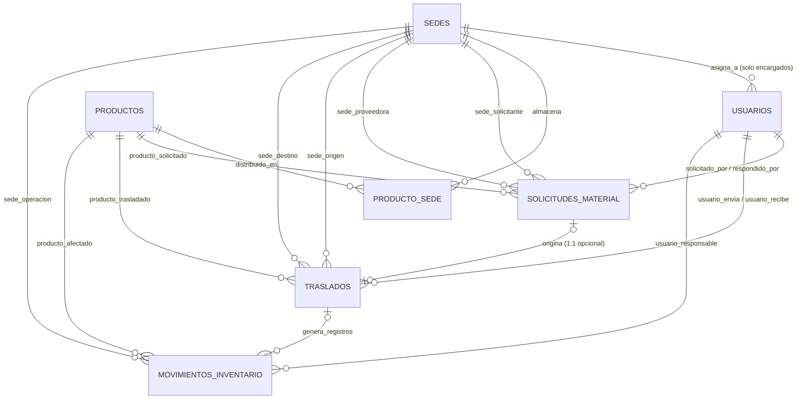

# ⚡ Sistema de Inventario Multisede - Material Eléctrico
## Documento de Diseño y Diccionario de la Base de Datos (Fase 1: Modelo Relacional)
**Asignatura:** Ingeniería de Software 2  
**Motor de Base de Datos:** MySQL 8.0+ / MariaDB 10.5+  
**Script SQL:** [`database_schema.sql`](./database_schema.sql)  

---

## 1. Resumen Ejecutivo del Modelo

El modelo de datos está diseñado para resolver la operativa de una empresa comercializadora de material eléctrico con **4 sedes**, bajo las siguientes premisas fundamentales:

1. **Catálogo Global vs. Gestión Local:** Los productos tienen una definición técnica global (`productos`), pero cada sede gestiona de forma autónoma su stock, su precio de venta y su catálogo visible (`producto_sede`).
2. **Unidades de Medida Flexibles:** Soporte tanto para artículos unitarios como para mediciones continuas (ej. cables o perfiles por metros como `1.50m` o `2.40m`) mediante tipos de dato `DECIMAL(10,2)`.
3. **Control de Acceso Basado en Roles (RBAC):**
   - **Administrador:** Acceso global a todas las sedes y catálogos.
   - **Encargado de Sede:** Vinculado obligatoriamente a una única sede (`sede_id NOT NULL`).
   - **Empleado:** Usuario operativo móvil (`sede_id NULL`), selecciona la sede al momento de registrar ventas o solicitudes.
4. **Ciclo de Reabastecimiento Multisede:** Solicitudes de material insatisfechas que se convierten de forma controlada en traslados entre sedes con actualización del nuevo precio de venta vigente en destino.
5. **Auditoría e Inmutabilidad (Kardex):** Tabla de movimientos históricos que registra cada variación física de inventario.

---

## 2. Diagrama Entidad-Relación (ER)



---

## 3. Diccionario de Datos

### 3.1. Tabla: `sedes`
Representa los puntos de venta y bodegas de la empresa.

| Campo | Tipo de Dato | Nulo | Clave | Default | Descripción |
| :--- | :--- | :---: | :---: | :---: | :--- |
| `id` | `INT UNSIGNED` | NO | **PK** | `AUTO_INCREMENT` | Identificador único de la sede. |
| `nombre` | `VARCHAR(100)` | NO | **UQ** | | Nombre de la sucursal (ej. Sede Central, Sede Norte). |
| `ciudad` | `VARCHAR(100)` | NO | | | Ciudad donde opera la sede. |
| `direccion` | `VARCHAR(255)` | SÍ | | `NULL` | Dirección física del establecimiento. |
| `telefono` | `VARCHAR(20)` | SÍ | | `NULL` | Teléfono de contacto. |
| `activo` | `BOOLEAN` | NO | | `TRUE` | Permite deshabilitar sedes sin borrar historial. |
| `created_at` | `TIMESTAMP` | NO | | `CURRENT_TIMESTAMP` | Fecha de creación del registro. |
| `updated_at` | `TIMESTAMP` | NO | | `CURRENT_TIMESTAMP` | Fecha de última actualización. |

---

### 3.2. Tabla: `usuarios`
Gestiona la autenticación, roles y asignación de sede para el inicio de sesión.

| Campo | Tipo de Dato | Nulo | Clave | Default | Descripción |
| :--- | :--- | :---: | :---: | :---: | :--- |
| `id` | `INT UNSIGNED` | NO | **PK** | `AUTO_INCREMENT` | Identificador único del usuario. |
| `nombre_completo` | `VARCHAR(150)` | NO | | | Nombres y apellidos. |
| `username` | `VARCHAR(50)` | NO | **UQ** | | Nombre de usuario para login. |
| `email` | `VARCHAR(100)` | SÍ | **UQ** | `NULL` | Correo electrónico de contacto/recuperación. |
| `password_hash` | `VARCHAR(255)` | NO | | | Hash seguro de la contraseña (bcrypt/argon2). |
| `rol` | `ENUM('ADMINISTRADOR', 'ENCARGADO', 'EMPLEADO')` | NO | | | Rol que define los permisos en el sistema. |
| `sede_id` | `INT UNSIGNED` | SÍ | **FK** | `NULL` | Sede asignada (FK `sedes.id`). |
| `estado` | `ENUM('ACTIVO', 'INACTIVO')` | NO | | `'ACTIVO'` | Estado de la cuenta de usuario. |
| `ultimo_login` | `DATETIME` | SÍ | | `NULL` | Fecha y hora del último acceso exitoso. |
| `created_at` | `TIMESTAMP` | NO | | `CURRENT_TIMESTAMP` | Fecha de registro. |
| `updated_at` | `TIMESTAMP` | NO | | `CURRENT_TIMESTAMP` | Última actualización. |

*Restricciones Clave:*
- **FK:** `sede_id` $\rightarrow$ `sedes(id)` `ON DELETE RESTRICT ON UPDATE CASCADE`.
- **CHECK (`chk_usuario_sede_por_rol`):**
  ```sql
  CHECK (
      (rol = 'ENCARGADO' AND sede_id IS NOT NULL) OR
      (rol IN ('ADMINISTRADOR', 'EMPLEADO') AND sede_id IS NULL)
  )
  ```

---

### 3.3. Tabla: `productos`
Catálogo global de especificaciones de materiales eléctricos.

| Campo | Tipo de Dato | Nulo | Clave | Default | Descripción |
| :--- | :--- | :---: | :---: | :---: | :--- |
| `id` | `INT UNSIGNED` | NO | **PK** | `AUTO_INCREMENT` | Identificador único del producto. |
| `codigo_sku` | `VARCHAR(50)` | NO | **UQ** | | Código de producto / SKU / Código de barras. |
| `nombre` | `VARCHAR(150)` | NO | | | Nombre comercial del material. |
| `descripcion` | `TEXT` | SÍ | | `NULL` | Ficha técnica o características adicionales. |
| `unidad_medida` | `VARCHAR(20)` | NO | | `'UNIDAD'` | Unidad de medida (`METRO`, `UNIDAD`, `ROLLO`, `CAJA`). |
| `activo` | `BOOLEAN` | NO | | `TRUE` | Disponibilidad general en el sistema. |
| `created_at` | `TIMESTAMP` | NO | | `CURRENT_TIMESTAMP` | Fecha de alta. |
| `updated_at` | `TIMESTAMP` | NO | | `CURRENT_TIMESTAMP` | Fecha de modificación. |

---

### 3.4. Tabla: `producto_sede`
Tabla intermedia que almacena el inventario físico y la tarifa local de cada producto por sede.

| Campo | Tipo de Dato | Nulo | Clave | Default | Descripción |
| :--- | :--- | :---: | :---: | :---: | :--- |
| `id` | `INT UNSIGNED` | NO | **PK** | `AUTO_INCREMENT` | Identificador del registro producto-sede. |
| `producto_id` | `INT UNSIGNED` | NO | **FK, UQ1** | | Referencia al producto (`productos.id`). |
| `sede_id` | `INT UNSIGNED` | NO | **FK, UQ1** | | Referencia a la sede (`sedes.id`). |
| `stock_actual` | `DECIMAL(10,2)` | NO | | `0.00` | Cantidad física disponible en esta sede. |
| `stock_minimo` | `DECIMAL(10,2)` | NO | | `0.00` | Umbral para alertas de reabastecimiento. |
| `precio_venta` | `DECIMAL(12,2)` | NO | | | Precio de venta asignado a esta sede. |
| `disponible_en_sede` | `BOOLEAN` | NO | | `TRUE` | Si `FALSE`, la sede no comercializa esta línea. |
| `created_at` | `TIMESTAMP` | NO | | `CURRENT_TIMESTAMP` | Fecha de vinculación. |
| `updated_at` | `TIMESTAMP` | NO | | `CURRENT_TIMESTAMP` | Última actualización de precio o stock. |

*Restricciones Clave:*
- **UNIQUE KEY:** `uk_producto_sede (producto_id, sede_id)`.
- **CHECK:** `stock_actual >= 0.00`, `stock_minimo >= 0.00`, `precio_venta >= 0.00`.

---

### 3.5. Tabla: `solicitudes_material`
Requerimiento formal generado por un empleado ante falta de stock.

| Campo | Tipo de Dato | Nulo | Clave | Default | Descripción |
| :--- | :--- | :---: | :---: | :---: | :--- |
| `id` | `INT UNSIGNED` | NO | **PK** | `AUTO_INCREMENT` | Identificador de la solicitud. |
| `producto_id` | `INT UNSIGNED` | NO | **FK** | | Producto requerido (`productos.id`). |
| `sede_solicitante_id` | `INT UNSIGNED` | NO | **FK** | | Sede donde se necesita el material (`sedes.id`). |
| `sede_proveedora_id` | `INT UNSIGNED` | SÍ | **FK** | `NULL` | Sede sugerida o asignada para despachar (`sedes.id`). |
| `usuario_solicitante_id` | `INT UNSIGNED` | NO | **FK** | | Empleado que crea la solicitud (`usuarios.id`). |
| `cantidad_solicitada` | `DECIMAL(10,2)` | NO | | | Cantidad requerida (`> 0`). |
| `estado` | `ENUM(...)` | NO | | `'PENDIENTE'` | `'PENDIENTE'`, `'ATENDIDA'`, `'RECHAZADA'`, `'CANCELADA'`. |
| `motivo_solicitud` | `VARCHAR(255)` | SÍ | | `NULL` | Motivo o justificación del empleado. |
| `motivo_rechazo` | `VARCHAR(255)` | SÍ | | `NULL` | Causa en caso de rechazo. |
| `usuario_respuesta_id` | `INT UNSIGNED` | SÍ | **FK** | `NULL` | Encargado o Admin que resolvió la solicitud. |
| `fecha_respuesta` | `DATETIME` | SÍ | | `NULL` | Fecha y hora en que se atendió/rechazó. |
| `created_at` | `TIMESTAMP` | NO | | `CURRENT_TIMESTAMP` | Fecha de creación. |
| `updated_at` | `TIMESTAMP` | NO | | `CURRENT_TIMESTAMP` | Última actualización. |

---

### 3.6. Tabla: `traslados`
Control del envío físico de mercadería entre sedes y actualización tarifaria.

| Campo | Tipo de Dato | Nulo | Clave | Default | Descripción |
| :--- | :--- | :---: | :---: | :---: | :--- |
| `id` | `INT UNSIGNED` | NO | **PK** | `AUTO_INCREMENT` | Identificador único del traslado. |
| `solicitud_id` | `INT UNSIGNED` | SÍ | **FK, UQ** | `NULL` | Solicitud asociada (1:1 opcional). |
| `producto_id` | `INT UNSIGNED` | NO | **FK** | | Producto trasladado (`productos.id`). |
| `sede_origen_id` | `INT UNSIGNED` | NO | **FK** | | Sede que despacha el material (`sedes.id`). |
| `sede_destino_id` | `INT UNSIGNED` | NO | **FK** | | Sede que recibe el material (`sedes.id`). |
| `cantidad` | `DECIMAL(10,2)` | NO | | | Cantidad trasladada (`> 0`). |
| `precio_destino_vigente` | `DECIMAL(12,2)` | NO | | | **Precio de venta que regirá en la sede destino.** |
| `usuario_envia_id` | `INT UNSIGNED` | NO | **FK** | | Usuario que realiza el despacho. |
| `usuario_recibe_id` | `INT UNSIGNED` | SÍ | **FK** | `NULL` | Usuario que confirma la recepción. |
| `estado` | `ENUM(...)` | NO | | `'PENDIENTE'` | `'PENDIENTE'`, `'COMPLETADO'`, `'CANCELADO'`. |
| `observaciones` | `VARCHAR(255)` | SÍ | | `NULL` | Guía de despacho o notas. |
| `fecha_envio` | `DATETIME` | NO | | `CURRENT_TIMESTAMP` | Momento del despacho. |
| `fecha_recepcion` | `DATETIME` | SÍ | | `NULL` | Momento de la confirmación en destino. |
| `created_at` | `TIMESTAMP` | NO | | `CURRENT_TIMESTAMP` | Fecha de creación del registro. |
| `updated_at` | `TIMESTAMP` | NO | | `CURRENT_TIMESTAMP` | Última modificación. |

*Restricciones Clave:*
- **CHECK:** `sede_origen_id <> sede_destino_id` (impide traslados a la misma sede).
- **CHECK:** `cantidad > 0.00` y `precio_destino_vigente >= 0.00`.

---

### 3.7. Tabla: `movimientos_inventario` (Kardex)
Historial inmutable de auditoría para cada entrada, salida, ajuste o traslado.

| Campo | Tipo de Dato | Nulo | Clave | Default | Descripción |
| :--- | :--- | :---: | :---: | :---: | :--- |
| `id` | `INT UNSIGNED` | NO | **PK** | `AUTO_INCREMENT` | Identificador único del movimiento. |
| `tipo_movimiento` | `ENUM(...)` | NO | | | `'ENTRADA'`, `'SALIDA'`, `'AJUSTE_POSITIVO'`, `'AJUSTE_NEGATIVO'`, `'TRASLADO_SALIDA'`, `'TRASLADO_ENTRADA'`. |
| `producto_id` | `INT UNSIGNED` | NO | **FK** | | Producto afectado (`productos.id`). |
| `sede_id` | `INT UNSIGNED` | NO | **FK** | | Sede donde ocurre la afectación (`sedes.id`). |
| `usuario_id` | `INT UNSIGNED` | NO | **FK** | | Usuario responsable de la transacción (`usuarios.id`). |
| `cantidad` | `DECIMAL(10,2)` | NO | | | Cantidad de unidades/metros movidos (`> 0`). |
| `stock_anterior` | `DECIMAL(10,2)` | NO | | | Saldo físico antes de la operación. |
| `stock_posterior` | `DECIMAL(10,2)` | NO | | | Saldo físico resultante después de la operación. |
| `precio_unitario` | `DECIMAL(12,2)` | SÍ | | `NULL` | Foto del precio de venta vigente al momento del movimiento. |
| `traslado_id` | `INT UNSIGNED` | SÍ | **FK** | `NULL` | Enlace a `traslados.id` si provino de un traslado. |
| `referencia_documento` | `VARCHAR(100)` | SÍ | | `NULL` | Factura, remisión, boleta o acta de ajuste. |
| `motivo_observacion` | `TEXT` | SÍ | | `NULL` | Explicación detallada de la operación. |
| `fecha_movimiento` | `DATETIME` | NO | | `CURRENT_TIMESTAMP` | Fecha y hora exacta de la transacción. |
| `created_at` | `TIMESTAMP` | NO | | `CURRENT_TIMESTAMP` | Registro del sistema. |

---

## 4. Guía de Autenticación y Recomendación de Hashing (Node.js)

### 4.1. Librería Recomendada: `bcrypt`
Para la etapa de Backend en Node.js, la librería recomendada es **`bcrypt`** (o su equivalente puro JS **`bcryptjs`**):

- **Factor de Trabajo (Cost Factor / Salt Rounds):** Se recomienda usar `10` o `12` rounds. Un valor de 10 toma aproximadamente ~100ms por hash en CPU, lo cual es imperceptible para un usuario humano pero hace computacionalmente imposible el craqueo por fuerza bruta de millones de combinaciones en GPU.
- **Sal Automática:** Genera automáticamente un vector de sal criptográfico único para cada hash.
- **Tamaño de Almacenamiento:** El hash resultante mide exactamente 60 caracteres (iniciando en `$2b$10$...`), por lo que la columna `password_hash VARCHAR(255)` está optimizada y deja margen para futuras migraciones.

#### Ejemplo de Referencia para el Backend (Fase 2):
```javascript
import bcrypt from 'bcrypt';

// Al registrar o cambiar contraseña
const saltRounds = 10;
const passwordHash = await bcrypt.hash(plainTextPassword, saltRounds);

// Al iniciar sesión
const isValid = await bcrypt.compare(plainTextPassword, user.password_hash);
if (isValid) {
  // Generar JWT y actualizar usuarios.ultimo_login = NOW()
}
```

---

## 5. Instrucciones para Ejecutar el Script en MySQL

1. Abre tu cliente MySQL favorito (**MySQL Workbench**, **DBeaver**, **phpMyAdmin** o la terminal).
2. Ejecuta el archivo [`database_schema.sql`](./database_schema.sql) o carga el contenido directamente:
   ```bash
   mysql -u root -p < database_schema.sql
   ```
3. El script creará la base de datos `inventario_electrico_ce`, las 7 tablas con todas sus restricciones, e insertará los **datos de prueba (seed data)** con:
   - Las 4 sedes comerciales e industriales.
   - 4 usuarios de prueba (Admin, 2 Encargados y 1 Empleado).
   - Catálogo de materiales eléctricos (cables, conduit, breakers, paneles y luminarias solares).
   - Precios y stocks diferenciados por sede.
   - Ejemplos de solicitud, traslado y kardex inicial.
